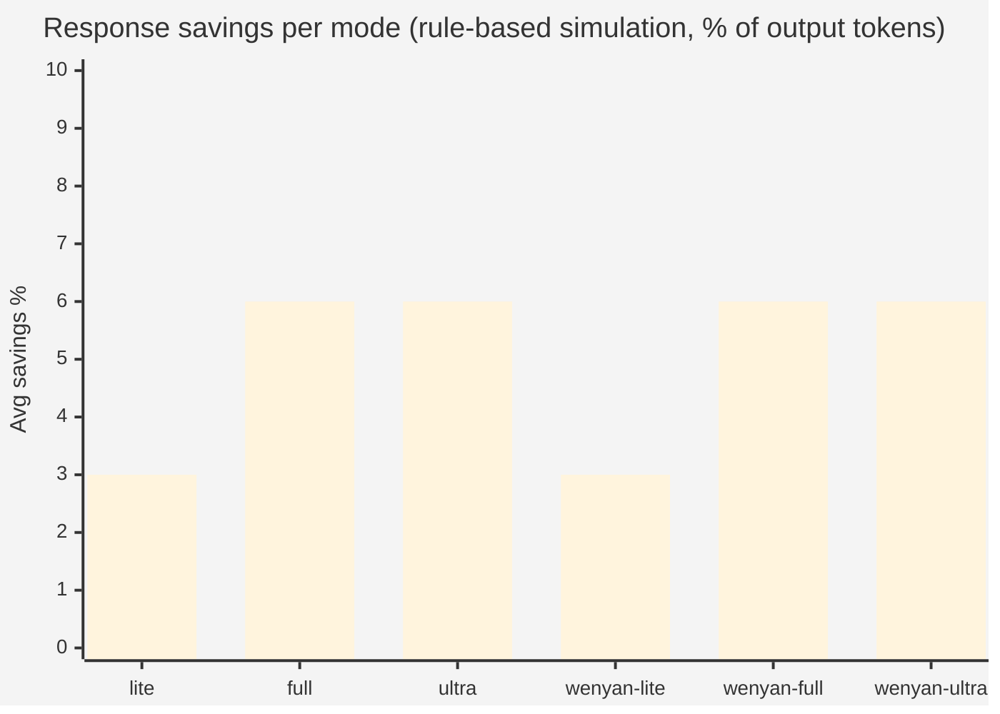
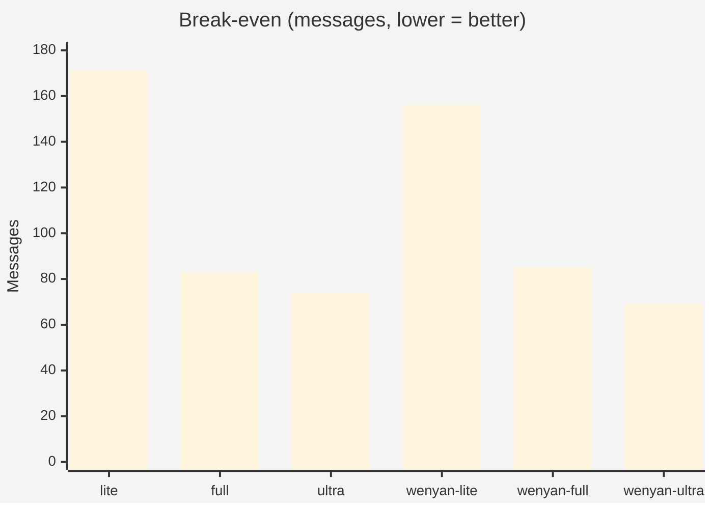

<p align="center">
  
</p>

<h1 align="center">caveman</h1>

<p align="center">
  <strong>why use many token when few do trick</strong>
</p>

<p align="center">
  <a href="https://github.com/JuliusBrussee/caveman/stargazers"></a>
  <a href="https://github.com/JuliusBrussee/caveman/commits/main"></a>
  <a href="LICENSE"></a>
</p>

<p align="center">
  <a href="#before--after">Before/After</a> •
  <a href="#install">Install</a> •
  <a href="#what-you-get">What You Get</a> •
  <a href="#benchmarks">Benchmarks</a> •
  <a href="./INSTALL.md">Full install guide</a>
</p>

---

A [Claude Code](https://docs.anthropic.com/en/docs/claude-code) skill/plugin (also Codex, Gemini, Cursor, Windsurf, Cline, Copilot, 30+ more) that makes agent talk like caveman — cuts **~75% of output tokens**, keeps full technical accuracy. Brain still big. Mouth small.

## Before / After

<table>
<tr>
<td width="50%">

### 🗣️ Normal Claude (69 tokens)

> "The reason your React component is re-rendering is likely because you're creating a new object reference on each render cycle. When you pass an inline object as a prop, React's shallow comparison sees it as a different object every time, which triggers a re-render. I'd recommend using useMemo to memoize the object."

</td>
<td width="50%">

###  Caveman Claude (19 tokens)

> "New object ref each render. Inline object prop = new ref = re-render. Wrap in `useMemo`."

</td>
</tr>
<tr>
<td>

### 🗣️ Normal Claude

> "Sure! I'd be happy to help you with that. The issue you're experiencing is most likely caused by your authentication middleware not properly validating the token expiry. Let me take a look and suggest a fix."

</td>
<td>

###  Caveman Claude

> "Bug in auth middleware. Token expiry check use `<` not `<=`. Fix:"

</td>
</tr>
</table>

**Same fix. 75% less word. Brain still big.**

```
┌─────────────────────────────────────┐
│  TOKENS SAVED          ████████ 75% │
│  TECHNICAL ACCURACY    ████████ 100%│
│  SPEED INCREASE        ████████ ~3x │
│  VIBES                 ████████ OOG │
└─────────────────────────────────────┘
```

Pick your level of grunt — `lite` (drop filler), `full` (default caveman), `ultra` (telegraphic), or `wenyan` (classical Chinese, even shorter). One command switch. Cost go down forever.

<table align="center">
<tr><td>

###  Like this trick? Now get whole agent — **caveman-code**

This skill shrink what agent **say**. **[caveman-code](https://github.com/JuliusBrussee/caveman-code)** shrink **everything** — full terminal coding agent, caveman top to bottom. **~2× fewer tokens than Codex** on identical tasks. 20+ providers · plan mode · autopilot goal loop · MIT.

```bash
npm install -g @juliusbrussee/caveman-code
```

[**▶ Try caveman-code now →**](https://github.com/JuliusBrussee/caveman-code) — *why use many token when whole agent save*

</td></tr>
</table>

## Install

One line. Find every agent. Install for each.

```bash
# macOS / Linux / WSL / Git Bash
curl -fsSL https://raw.githubusercontent.com/JuliusBrussee/caveman/main/install.sh | bash

# Windows (PowerShell 5.1+)
irm https://raw.githubusercontent.com/JuliusBrussee/caveman/main/install.ps1 | iex
```

~30 seconds. Needs Node ≥18. Skip agent you no have. Safe to re-run.

**Trigger:** type `/caveman` or say "talk like caveman". Stop with "normal mode".

One agent only, manual command, or any of 30+ other agents → [**INSTALL.md**](./INSTALL.md).
Install break? Open agent, say *"Read CLAUDE.md and INSTALL.md, install caveman for me."* Agent fix own brain.

## What You Get

| Skill | What |
|---|---|
| `/caveman [lite\|full\|ultra\|wenyan]` | Compress every reply. Levels stick until session end. |
| `/caveman-commit` | Conventional Commit messages, ≤50 char subject. Why over what. |
| `/caveman-review` | One-line PR comments: `L42: 🔴 bug: user null. Add guard.` |
| `/caveman-stats` | Real session token usage + lifetime savings + USD. Tweetable line via `--share`. |
| `/caveman-compress <file>` | Rewrite memory file (e.g. `CLAUDE.md`) into caveman-speak. Cuts ~46% input tokens every session. Code/URLs/paths byte-preserved. |
| `caveman-shrink` | MCP middleware. Wraps any MCP server, compresses tool descriptions. [npm](https://www.npmjs.com/package/caveman-shrink). |
| `caveman-mode` | MCP server (HTTP/SSE). No install — just start server, register URL. Works with VS Code Copilot, Claude Code, Cursor, any MCP client. |
| `cavecrew-*` | Caveman subagents (investigator/builder/reviewer). ~60% fewer tokens than vanilla, main context lasts longer. |

**Statusline badge** — Claude Code shows `[CAVEMAN] ⛏ 12.4k` (lifetime tokens saved). Updates every `/caveman-stats` run. Set `CAVEMAN_STATUSLINE_SAVINGS=0` to silence.

Auto-activate every session: Claude Code, Codex, Gemini (built-in). Cursor / Windsurf / Cline / Copilot get always-on rule files via `--with-init`. Other agents trigger with `/caveman` per session. Full feature matrix in [INSTALL.md](./INSTALL.md#what-you-get).

## MCP Server — Zero Install

No hooks. No shell scripts. No plugin system. Start one server, register URL in config. Every MCP client get caveman.

### Start server

```bash
# clone or npx
node src/mcp-servers/caveman-mode/index.js

# custom port or mode
node src/mcp-servers/caveman-mode/index.js --port 4000
CAVEMAN_DEFAULT_MODE=ultra node src/mcp-servers/caveman-mode/index.js
```

Server start on `http://localhost:3100`. Health check: `curl http://localhost:3100/health`.

### Register in VS Code Copilot

`%APPDATA%\Code - Insiders\User\mcp.json` (Windows) or `~/.config/Code/User/mcp.json` (Linux/Mac):

```jsonc
{
  "servers": {
    "caveman-mode": {
      "type": "sse",
      "url": "http://localhost:3100/sse"
    }
  }
}
```

**Mode override per client** — append `?mode=<level>` to URL:

```jsonc
{
  "servers": {
    "caveman-mode": {
      "type": "sse",
      "url": "http://localhost:3100/sse?mode=ultra"
    }
  }
}
```

Valid levels: `lite` · `full` · `ultra` · `wenyan-lite` · `wenyan-full` · `wenyan-ultra`

### Register in Claude Code

`~/.claude/settings.json`:

```jsonc
{
  "mcpServers": {
    "caveman-mode": {
      "type": "sse",
      "url": "http://localhost:3100/sse"
    }
  }
}
```

Same `?mode=` override works here too — each client can use a different level against the same running server.

### Stdio mode (client spawns server — no separate start needed)

```jsonc
{
  "servers": {
    "caveman-mode": {
      "type": "stdio",
      "command": "node",
      "args": ["/path/to/caveman_mcp/src/mcp-servers/caveman-mode/index.js", "--stdio"],
      "env": {
        "CAVEMAN_DEFAULT_MODE": "ultra"
      }
    }
  }
}
```

Stdio mode support `env` field — change default mode per client config without touching server.

### How it work

MCP `initialize` handshake return `instructions` field containing caveman rules for active mode. Client inject as system context — caveman active from message one. No `/caveman` command needed.

| Transport | When use |
|---|---|
| **HTTP/SSE** (default) | Server run separately, multiple clients share one process |
| **stdio** | Client spawn server as subprocess, `env` vars work in config |

### Tools available after connect

| Tool | What |
|---|---|
| `activate_caveman(mode?)` | Switch intensity level mid-session |
| `get_commit_rules` | Fetch caveman commit style rules |
| `get_review_rules` | Fetch caveman code review rules |
| `get_current_mode` | Show active mode |
| `deactivate_caveman` | Turn off, return to normal prose |

### MCP ON vs OFF — all modes

```bash
node benchmarks/run_mcp_compare.mjs          # all 6 modes vs baseline
node benchmarks/run_mcp_compare.mjs --mode ultra  # single mode
```

Start server, connect each mode via SSE, measure actual `instructions` payload + rule-based compression. No API key.

| Mode | Sys tokens | Overhead | Avg output | Savings | Break-even |
|---|---:|---:|---:|---:|---:|
| ○ baseline | 7 | — | 119 | 0% | — |
| ● lite | 519 | +512 | 116 | 3% | 171 msgs |
| ● full | 504 | +497 | 113 | 6% | 83 msgs |
| ● ultra | 524 | +517 | 112 | 6% | 74 msgs |
| ● wenyan-lite | 475 | +468 | 116 | 3% | 156 msgs |
| ● wenyan-full | 515 | +508 | 113 | 6% | 85 msgs |
| ● wenyan-ultra | 489 | +482 | 112 | 6% | **69 msgs** |

MCP overhead (~500 tokens) paid once per session. Every response after break-even is net saving.

> Rule-based sim: 3–6% (code blocks preserved). Real LLM rewrites prose — actual savings **65–75%** ([benchmarks](./benchmarks/)).

#### Savings per mode



#### Break-even: responses until MCP overhead paid back



`ultra` and `wenyan-ultra` reach break-even fastest. After that, every message nets tokens back.

### Mode benchmark (local, no API)

```bash
node benchmarks/run_modes.mjs
```

Measure system prompt token overhead across all 7 modes without MCP server. No API key needed.

```
Mode          Sys tokens  Overhead  Avg savings
baseline           7        —           0%
lite             519      +512          3%
full             504      +497          6%
ultra            524      +517          6%
wenyan-lite      475      +468          3%
wenyan-full      515      +508          6%
wenyan-ultra     489      +482          6%
```

## Benchmarks

Real token counts from the Claude API. Average **65% output reduction** across 10 prompts (range 22-87%).

<!-- BENCHMARK-TABLE-START -->
| Task | Normal | Caveman | Saved |
|------|-------:|--------:|------:|
| Explain React re-render bug | 1180 | 159 | 87% |
| Fix auth middleware token expiry | 704 | 121 | 83% |
| Set up PostgreSQL connection pool | 2347 | 380 | 84% |
| Explain git rebase vs merge | 702 | 292 | 58% |
| Refactor callback to async/await | 387 | 301 | 22% |
| Architecture: microservices vs monolith | 446 | 310 | 30% |
| Review PR for security issues | 678 | 398 | 41% |
| Docker multi-stage build | 1042 | 290 | 72% |
| Debug PostgreSQL race condition | 1200 | 232 | 81% |
| Implement React error boundary | 3454 | 456 | 87% |
| **Average** | **1214** | **294** | **65%** |
<!-- BENCHMARK-TABLE-END -->

Raw data and reproduction script: [`benchmarks/`](./benchmarks/). Three-arm eval harness (baseline / terse / skill) lives in [`evals/`](./evals/) — caveman compared against `Answer concisely.` not against verbose default, so the delta is honest.

**caveman-compress receipts** (real memory files):

| File | Original | Compressed | Saved |
|---|---:|---:|---:|
| `claude-md-preferences.md` | 706 | 285 | **59.6%** |
| `project-notes.md` | 1145 | 535 | **53.3%** |
| `claude-md-project.md` | 1122 | 636 | **43.3%** |
| `todo-list.md` | 627 | 388 | **38.1%** |
| `mixed-with-code.md` | 888 | 560 | **36.9%** |
| **Average** | **898** | **481** | **46%** |

> [!IMPORTANT]
> Caveman only affects output tokens — thinking/reasoning tokens untouched. Caveman no make brain smaller. Caveman make *mouth* smaller. Biggest win is **readability and speed**, cost savings a bonus.

A March 2026 paper ["Brevity Constraints Reverse Performance Hierarchies in Language Models"](https://arxiv.org/abs/2604.00025) found that constraining large models to brief responses **improved accuracy by 26 points** on certain benchmarks. Verbose not always better. Sometimes less word = more correct.

## How It Work

1. Install drop skill file in agent.
2. Skill tell agent: drop filler, keep substance, use fragments.
3. For Claude Code, hook also write tiny flag file each session — agent see flag, talk caveman from message one. No need say `/caveman`.
4. Stats command read Claude Code session log, count tokens saved, write number to statusline.
5. Caveman-compress sub-skill rewrite memory files (CLAUDE.md, project notes) so each session start with smaller context. Save tokens forever, not just one reply.

Maintainer detail (hook architecture, file ownership, CI sync) live in [CLAUDE.md](./CLAUDE.md).

## Lobster, Meet Rock 🦞 

[**OpenClaw**](https://openclaw.ai) the self-host gateway. One box, many agent inside (Claude Code, Codex, Pi, OpenCode), wired to your Slack / Discord / iMessage / Telegram / whatever. Tagline: *"The lobster way."* Lobster strong. Lobster smart. Lobster also talk a lot.

Caveman teach lobster brevity — same canonical installer, scoped to one agent:

```bash
# macOS / Linux / WSL
curl -fsSL https://raw.githubusercontent.com/JuliusBrussee/caveman/main/install.sh | bash -s -- --only openclaw

# Windows (PowerShell): no Node? install Node ≥18 first, then
npx -y github:JuliusBrussee/caveman -- --only openclaw
```

Two thing happen, no more:

1. **Skill drop** at `~/.openclaw/workspace/skills/caveman/SKILL.md` — spec-correct frontmatter (`version`, `always: true`), discoverable by `openclaw skills list`. Skill not auto-inject (OpenClaw load skill on demand) — that why we also do step 2.
2. **SOUL.md nudge.** Tiny marker-fenced block appended to `~/.openclaw/workspace/SOUL.md`. OpenClaw inject SOUL.md into *every* turn under "Project Context" (12K-per-file, 60K total — block well under). Lobster terse from message one. No `/caveman` per session. No nag.

```
~/.openclaw/workspace/
├── skills/caveman/SKILL.md   ← full ruleset, on-demand load
└── SOUL.md                    ← <!-- caveman-begin --> ... <!-- caveman-end -->
                                  ↑ auto-inject every turn
```

Custom workspace path? `OPENCLAW_WORKSPACE=/your/path` before the command. Uninstall: same one-liner with `--uninstall` — skill folder gone, SOUL.md block ripped out cleanly, your other workspace content stay untouched. Idempotent re-runs (frontmatter not double-prepended, marker block not duplicated).

Lobster claw still sharp. Lobster mouth now small. Brain still big.

## Caveman Ecosystem

Five tools. One philosophy: **agent do more with less**.

| Repo | What |
|------|------|
| [**caveman**](https://github.com/JuliusBrussee/caveman) *(you here)* | Output compression — *why use many token when few do trick* |
| [**caveman-code**](https://github.com/JuliusBrussee/caveman-code) | Whole terminal coding agent — *why use many token when whole agent can save* |
| [**cavemem**](https://github.com/JuliusBrussee/cavemem) | Cross-agent memory — *why agent forget when agent can remember* |
| [**cavekit**](https://github.com/JuliusBrussee/cavekit) | Spec-driven build loop — *why agent guess when agent can know* |
| [**cavegemma**](https://github.com/JuliusBrussee/finetune-caveman) | Gemma 4 31B fine-tuned on caveman pairs — *why prompt every turn when weight remember* |

Compose: cavekit drive build, caveman compress what agent *say*, cavemem compress what agent *remember*, cavegemma bake compression into weight, caveman-code ship it all as one terminal agent. One rock. Two rock. Three rock. Four rock. Five rock. That it.

## Links

- [INSTALL.md](./INSTALL.md) — full install matrix, all flags, per-agent detail
- [CONTRIBUTING.md](./CONTRIBUTING.md) — how to send patch
- [CLAUDE.md](./CLAUDE.md) — maintainer guide (file ownership, hook architecture, CI)
- [docs/](./docs/) — extra guides (Windows install, etc.)
- [Issues](https://github.com/JuliusBrussee/caveman/issues) — bug, feature, weird behavior

## Star This Repo

Caveman save you token, save you money. Star cost zero. Fair trade. ⭐

[](https://star-history.com/#JuliusBrussee/caveman&Date)

## Also by Julius Brussee

- **[Revu](https://github.com/JuliusBrussee/revu-swift)** — local-first macOS study app with FSRS spaced repetition. [revu.cards](https://revu.cards)

## License

MIT — free like mass mammoth on open plain.
